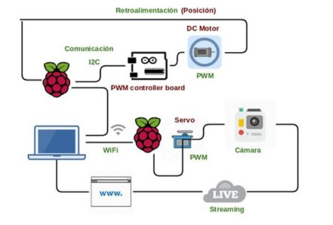

<!-- PROJECT LOGO -->

  <a>
    <
  </a>

  <h3 align="center">Aerial camera prototype </h3>

 

<!-- TABLE OF CONTENTS -->

  
Table of Contents

  <ol>
    <li>
      <a href="#about-the-project">About The Project</a>
      <ul>
        <li><a href="#built-with">Built With</a></li>
      </ul>
      </li>
  </ol>

<!-- ABOUT THE PROJECT -->
## About The Project

Control system composed of a suspended camera with four automated cables capable of tracing a path to a desired point and transmitting the content via livestream.

### Built With

This section should give a quick guide of the technology implemented.
* Raspberry PI
* Python
* I2C
